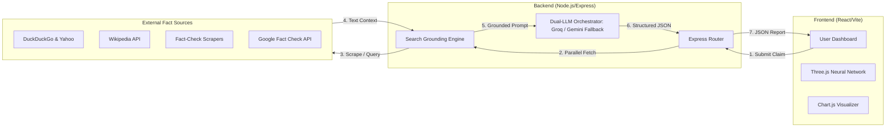
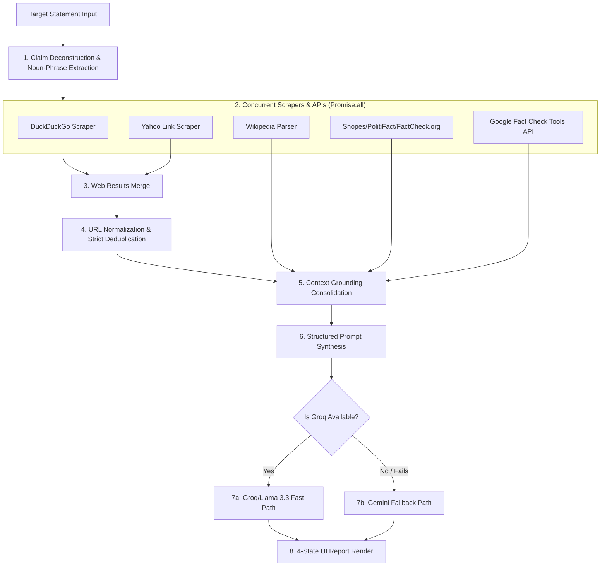

# <p align="center">🔍 TruthGuard AI</p>

<p align="center">
  <strong>The Ultimate Forensic AI Fraud, Deception & Fact-Checking Suite</strong>
</p>

<p align="center">
  
  
  
  
  
</p>

---

## 🌟 Overview

**TruthGuard AI** is a state-of-the-art forensic analysis platform designed to combat digital misinformation and AI-generated deception. Built using a fully decoupled **Frontend / Backend Architecture**, TruthGuard combines **Groq Llama 3.3-70B** (for sub-3-second real-time fact-checking) with **Google's Gemini 3.5** models (for fallback and specialized multi-modal tasks). It features a real-time web search fact-checking engine and provides a centralized dashboard for verifying viral news, deepfake audio, fraudulent job postings, and scientific research.

> [!IMPORTANT]
> This suite implements a hybrid Dual-LLM design: an ultra-fast path powered by Groq API + Llama 3.3-70B, and a comprehensive fallback/heavy pipeline powered by Gemini 3.5.

---

## 🚀 Specialized Verification Modules

TruthGuard AI features 7 specialized detection engines:

| Module | Engine | Verification Pipeline |
| :--- | :--- | :--- |
| **📰 Fake News** | Dual-LLM (Groq Llama 3.3 / Gemini) | Ultra-fast search grounding (Yahoo/DDG + Wikipedia + Google FC) + Groq/Llama fast path (< 3s). Gemini acts as automatic fallback. |
| **🖼️ AI Image** | Vision AI (Gemini) | Pixel forensics & visual artifact analysis to flag synthetic or manipulated images. |
| **🎤 Deepfake Voice** | Audio Analysis | Pitch, frequency, and spectral pattern detection via Web Audio API. |
| **💼 Fake Job** | Pattern AI (Gemini) | Scrutinizes salary anomalies, domain legitimacy, and urgent emotional triggers. |
| **🕵️ Fraud Behavior** | Biometrics AI | Analyzes mouse dynamics, typing velocity, and device patterns for bots/fraud. |
| **🔬 Fake Research** | Scientific AI (Gemini) | Audits research claims against citations, sample sizes, and methodology credibility. |
| **🌤️ Weather Check** | Hybrid AI (Gemini) | Cross-references forecasts against real-time OpenWeather data. |

---

## 🏗️ System Design & Architecture

TruthGuard AI uses a fully decoupled architecture optimized for real-time parallel data fetching and low-latency processing.


### 1. Character-Based System Flow Diagram
```
+------------------------------------------------------------+
|                  CLIENT (React/Vite Dashboard)             |
|                                                            |
|  [User Interface]   -->   [Three.js Neural Network Web]    |
|         |                        |                         |
|         v                        v                         |
|  [Claim Form Input] -->   [Chart.js Forensic Radars/Bars]  |
+------------------------------------------------------------+
                           |
                           | (HTTP POST /api/verify/text)
                           v
+------------------------------------------------------------+
|                   BACKEND (Node.js/Express)                |
|                                                            |
|         +----------------------------------------+         |
|         |           Express API Router           |         |
|         +----------------------------------------+         |
|                              |                             |
|                              v                             |
|         +----------------------------------------+         |
|         |       Parallel Search Aggregator       |         |
|         +----------------------------------------+         |
|            /           |            \          \           |
|           /            |             \          \          |
|          v             v              v          v         |
+------------------------------------------------------------+
     |                  |               |          |
     | (Query)          | (Query)       | (Query)  | (Query)
     v                  v               v          v
+------------+    +------------+    +-------+    +-----------+
| DuckDuckGo |    |   Yahoo    |    | Wiki  |    | Fact Check|
|   Search   |    |   Search   |    |  API  |    | Scrapers  |
+------------+    +------------+    +-------+    +-----------+
     |                  |               |          |
     |                  |               |          |
     v                  v               v          v
+------------------------------------------------------------+
|               Deduplication & Context Merge                |
|                              |                             |
|                              v                             |
|                 Structured Grounding Prompt                |
|                              |                             |
|                              v                             |
|                    Gemini AI Orchestrator                  |
|                              |                             |
|                              v                             |
|                 JSON Parse & Verdict Mapping               |
+------------------------------------------------------------+
                           |
                           | (JSON API Response)
                           v
+------------------------------------------------------------+
|                    CLIENT (Visual Render)                  |
|                                                            |
|   [4-State UI Cards]  <--  [Source List] <-- [Radar Chart] |
+------------------------------------------------------------+
```

### 2. High-Level System Architecture (Graph View)


### 3. Multi-Engine Verification Data Pipeline
The **Fake News Engine** implements a smart, parallel execution workflow to minimize latency and guarantee source coverage:



---

## ⚡ Custom Search Grounding Pipeline

The **Fake News Engine** implements a smart, resilient search-grounding architecture to supply Gemini with real-time, verified context:

1. **Multi-Engine Parallel Search**: Runs concurrent queries to both **DuckDuckGo** and a custom **Yahoo Search** scraper. If DuckDuckGo blocks queries with CAPTCHAs, Yahoo Search acts as an instant fallback and primary aggregator, extracting destination links and decoding nested tracking parameters.
2. **Unified URL Normalization**: Normalizes and deduplicates result URLs across indices (casing, protocols, subdomains) to ensure the Gemini model receives only unique web citations.
3. **5x Concurrent Wikipedia Engine**: Queries Wikipedia search and fetches full-article extracts in parallel using `Promise.all`, scanning entire body text for keyword matches (TF-IDF relevance score).
4. **Scraper Filtering**: Respectfully scrapes Snopes, PolitiFact, and FactCheck.org in parallel, filtering out navigation, author links, and sidebars to extract true fact-checks.
5. **Google Fact Check API**: Queries Google's public Fact Check Tools database for pre-existing debunks.
6. **Ultra-Fast Performance**: Built entirely around concurrency—dropping web search latency from **6.5s to ~2.0s**.

---

## 🛡️ TruthGuard AI Directives & Verdicts

The fact-checking pipeline enforces elite analytical rules:
* **Systematic Deconstruction**: Claims are broken down into sub-claims (entities, events, and data points) and verified individually.
* **Strict Numeric Verification**: Financial figures, sports scores, and statistics are double-checked across independent sources to prevent hallucinations.
* **Context Mashup Checks**: Cross-references numbers to ensure they aren't falsely attributed to competitors or unrelated events.
* **Four-State Verdict UI**: Dynamically outputs and displays `REAL` (Green), `FAKE` (Red), `PARTIALLY TRUE` (Orange), and `UNVERIFIED` (Yellow) verdicts on the dashboard.

---

## ✨ Design & Experience

*   **🌌 Dynamic 3D Neural Web**: Built with **Three.js**, showcasing drifting mesh orbs, halo rings, and connection lines for a premium aesthetic.
*   **📊 Interactive Analytics**: Real-time confidence scores and forensic breakdowns visualized via **Chart.js** radars and bars.
*   **🌓 Dual-Theme OS**: Seamless transition between high-contrast Dark Mode and crystal-clear Light Mode.
*   **⚡ Zero-Lag Micro-Animations**: Built using **Framer Motion** for fluid page-to-page transitions and interactive card flips.

---

## 🛠️ Tech Stack & Folder Structure

### **📁 Decoupled Folder Structure**
```bash
Fake-Dectector/
├── frontend/        # React 18, Vite, Tailwind CSS, Three.js, Chart.js (Vercel)
└── backend/         # Node.js, Express.js, Groq SDK, Google Gemini SDK, Axios, Cheerio (Render)
```

### **Frontend**
- **Framework**: React 18 (Vite build)
- **Styling**: Tailwind CSS & Framer Motion
- **Visuals**: Three.js (neural network graphics), Chart.js (forensics charts)
- **Components**: Lucide-React, custom SVG loaders

### **Backend**
- **Runtime**: Node.js & Express.js
- **AI Core**: Groq SDK + Llama 3.3-70B (Primary Fast Path, 3x Rotated Keys) & Google Gemini 3.5 Flash (Fallback / Multi-modal, 3x Rotated Keys)
- **Search & Scraping**: Axios, Cheerio, public Wikipedia API, DuckDuckGo Lite, Yahoo Search Scraper, Google Fact Check API
- **Weather API**: OpenWeatherMap integration

---

## ⚙️ Setup & Installation (Local Development)

Follow these steps to run the decoupled TruthGuard AI architecture locally:

### 1. Clone the Repository
```bash
git clone <repository-url>
cd Fake-Dectector
```

### 2. Configure Backend Environment
Navigate into the `backend/` folder, install dependencies, and create your `.env` file:
```bash
cd backend
npm install
```

Create a `backend/.env` file:
```env
GEMINI_API_KEY_1=your_google_gemini_api_key_1
GEMINI_API_KEY_2=your_google_gemini_api_key_2 (optional backup)
GEMINI_API_KEY_3=your_google_gemini_api_key_3 (optional backup)
GROQ_API_KEY_1=your_groq_api_key_1
GROQ_API_KEY_2=your_groq_api_key_2 (optional backup)
GROQ_API_KEY_3=your_groq_api_key_3 (optional backup)
OPENWEATHER_API_KEY=your_openweather_api_key
PORT=3000
```

Start the backend development server:
```bash
npm run dev
```

### 3. Configure Frontend Environment
In a new terminal window, navigate to the `frontend/` folder, install dependencies, and start the client:
```bash
cd ../frontend
npm install
npm run dev
```

The frontend will run at `http://localhost:5173` (or `5174`) and automatically proxy all `/api` requests to `http://localhost:3000` via Vite's proxy configuration.

---

## 📄 License

Distributed under the MIT License. See `LICENSE` for more information.
